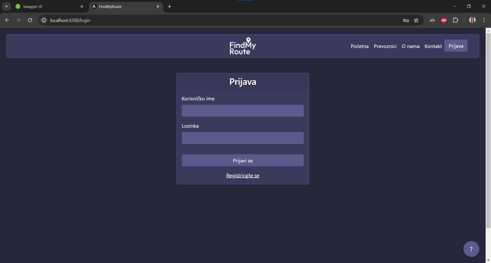
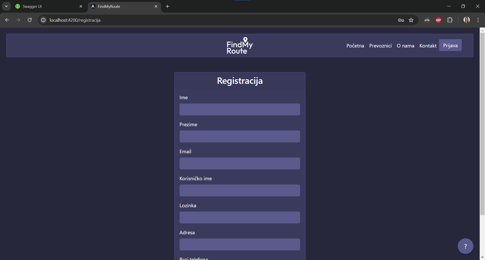
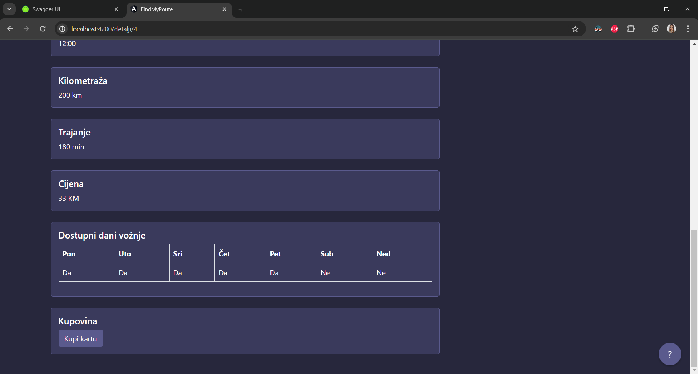
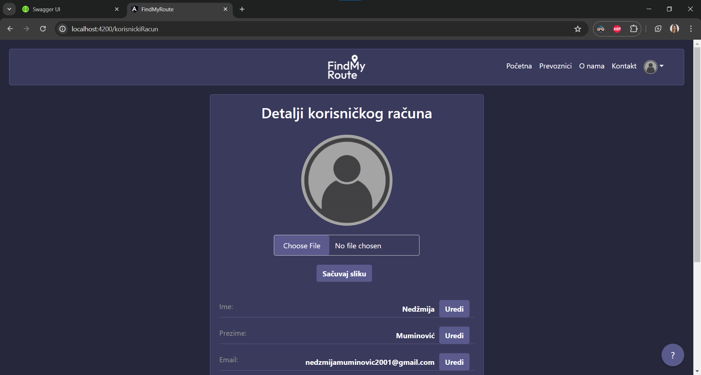
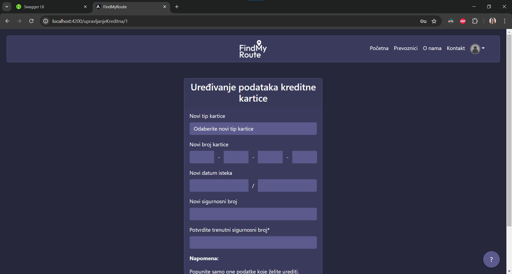
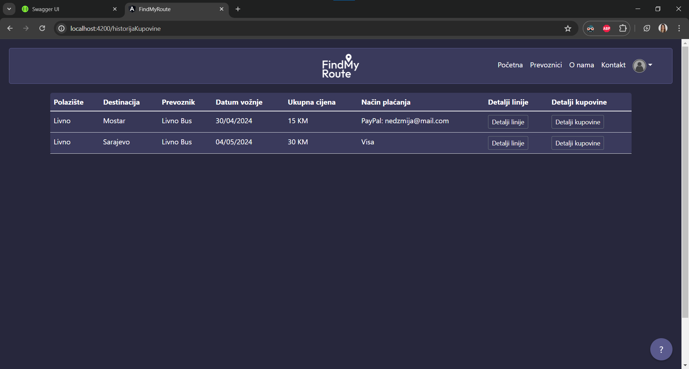
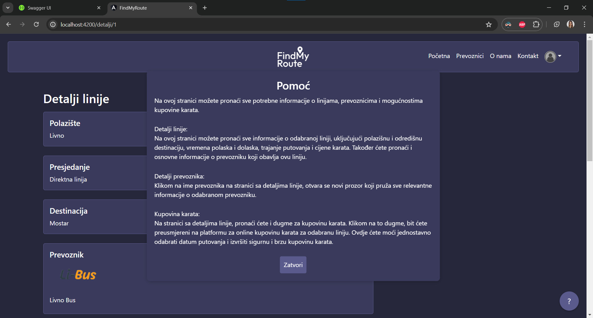
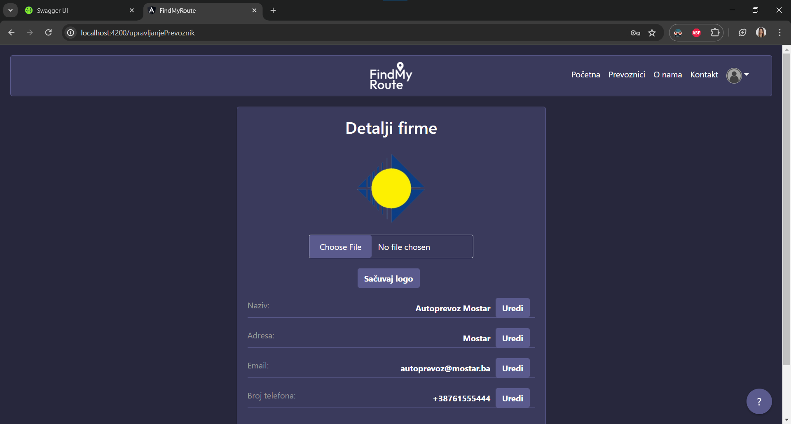
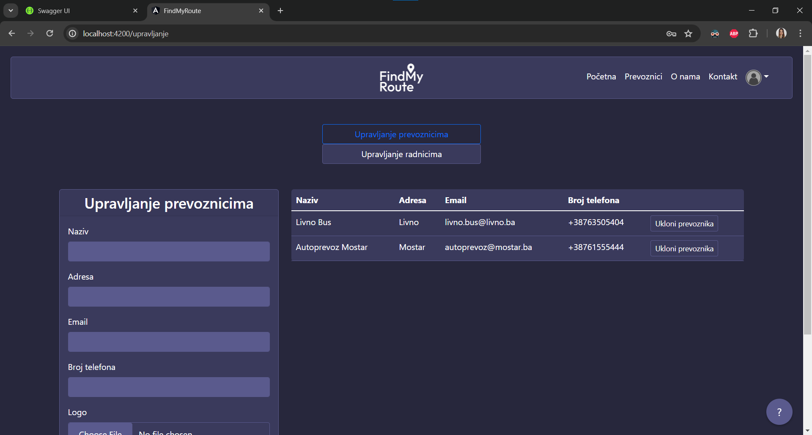

# FindMyRoute

FindMyRoute is a web application for public transport that allows users to search for bus and train routes between cities, purchase tickets, and manage their accounts. This README provides an overview of how to use the application, including setup instructions and basic usage guidelines.


## Table of Contents

- [Getting Started](#getting-started)
- [Usage](#usage)
  - [User Roles](#user-roles)
  - [Searching for Routes](#searching-for-routes)
  - [Buying Tickets](#buying-tickets)
- [Additional Features](#additional-features)
- [Screenshots](#screenshots)
  - [User Functionalities](#user-functionalities)
  - [Employee of a Public Transport Company Functionalities](#employee-of-a-public-transport-company-functionalities)
  - [Administrator Functionalities](#administrator-functionalities)

## Getting Started

1. Clone the FindMyRoute repository to your local machine:

   ```shell
   git clone https://github.com/NedzmijaMuminovic/FindMyRoute

2. Navigate to the project directory and open your API in Visual Studio. (FindMyRouteAPI.sln)

3. Open the Package Manager Console in order to generate a local SQL database named "FindMyRoute" and run these commands:
   ```shell
   add-migration testmigration
   update-database

5. Run the API.

6. To populate the database with sample data for demonstration purposes, run the "Generate" function in your Swagger. You will find it under the "TestniPodaci" section.
   
7. Open the Angular project (angular_app) in your preferred IDE or editor (WebStorm, VS Code...) and install the dependencies:
   ```shell
   npm install @angular-devkit/build-angular --force

8. Start the Angular development server:
   ```shell
   ng serve

## Usage

### User Roles

FindMyRoute has different user roles with varying functionalities:

- Basic User: You can create your own account and log in as a basic user, and if you do everything right, you should receive a welcome email upon successfully registering for an account on FindMyRoute. On the other hand, if you are feeling too lazy for that, you can just use the username "test1" and the password "test1". Basic users have the ability to edit their profiles.

- Employee of a Public Transport Company: Log in with the username "radnik1" and the password "radnik1" to access employee functionalities. Employees can add new routes, delete existing routes, and edit company details.

 - Administrator: Log in with the username "admin," the password "admin," and later the PIN "3004" to access administrative functionalities. Administrators can add new employees and new companies to the application, or delete existing ones.

### Searching for Routes

To search for routes between cities:

1. Visit the FindMyRoute web application.

2. Use the starting point and destination textboxes to enter your cities (try Livno and Mostar).

3. Click the search button to get a list of routes between the specified cities. If no direct route is available, the application will suggest routes with transfers (try Livno and Blagaj).

### Buying Tickets

To purchase tickets:

1. Register an account or log in if you haven't already.

2. Search for your desired route.

3. Click on the route to see details.

4. Select the number of tickets you want to purchase and the date you want to travel on.

5. Proceed to checkout and complete the ticket purchase.
   
6. When you make a purchase, you will receive an email confirmation for your ticket purchase. This email will include details of your purchase, including the route, date, and number of tickets. 

## Additional Features

- The application provides help buttons on every component/page to assist users in understanding how to use each feature. Either way, we are sure you will get the hang of it. Thank you for checking out our app!

## Screenshots
### User Functionalities














### Employee of a Public Transport Company Functionalities



### Administrator Functionalities


